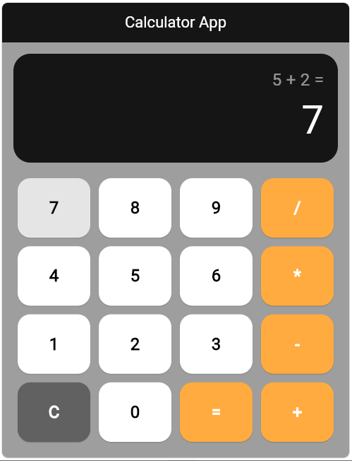
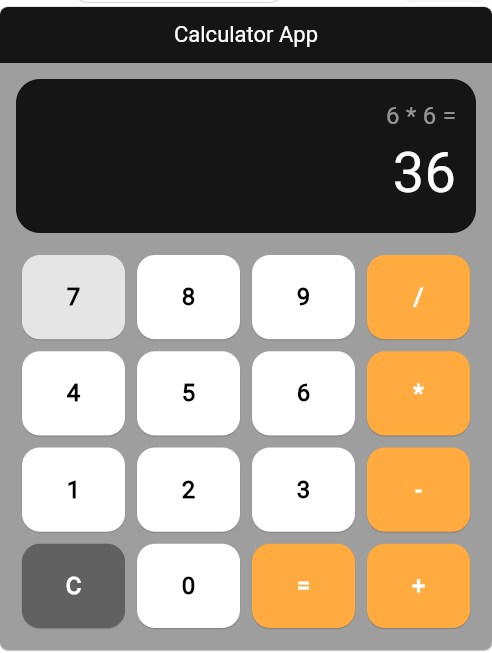

# 🧮 Calculator App

   
  <h3>A sleek and highly responsive Flutter Calculator Application</h3>
  <strong>Developed by Eng. Mohamed ElTahan</strong>
    

---

## 📖 Overview

The **Calculator App** is a beautifully designed, fully functional application built using **Flutter**. It offers an intuitive user interface and smooth calculations powered by the **Bloc/Cubit** state management pattern. It seamlessly handles essential arithmetic operations while displaying the calculation history (equation) directly on the screen for a better user experience.

---

## ✨ Features

- **Standard Operations:** Addition, subtraction, multiplication, and division.
- **Real-Time Display:** See the full equation dynamically built as you input numbers and operations.
- **Error Handling:** Gracefully handles invalid operations such as division by zero.
- **Clean Architecture:** Uses `Cubit` for a decoupled and easily maintainable state management system.
- **Responsive & Modern UI:** Adapts gracefully to screen sizes using Flutter's flexible layout widgets and an attractive dark theme aesthetic.

---

## 📸 Screenshots

Here is a glimpse of the application in action:

  
  

---

## 🛠 Built With

- **[Flutter](https://flutter.dev/)** - UI Toolkit for building natively compiled applications.
- **[Dart](https://dart.dev/)** - Client-optimized programming language.
- **[flutter_bloc](https://pub.dev/packages/flutter_bloc)** - Predictable state management library.

---

  
<i>Developed with ❤️ by Eng. Mohame ElTahan</i>

